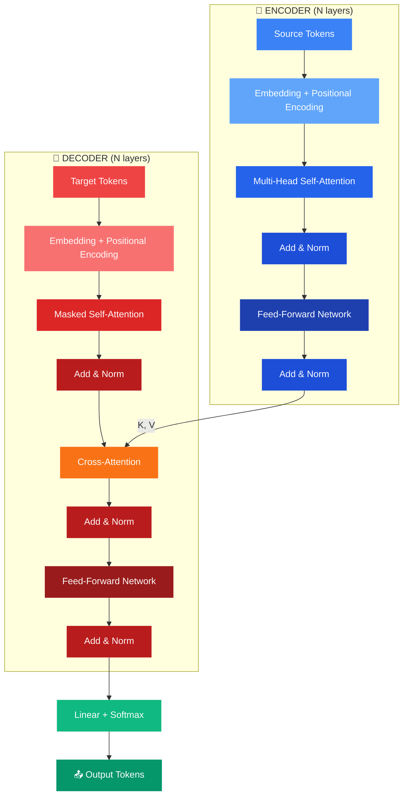

<div align="center">

<!-- Animated Header -->


<!-- Typing SVG -->
<a href="https://git.io/typing-svg"></a>

<br/>

<!-- Badges -->


<br/><br/>

<!-- Paper Badge -->
<a href="https://arxiv.org/abs/1706.03762"></a>


</div>

---

<div align="center">
<h2>🎯 What This Is</h2>
<p><i>A complete from-scratch PyTorch implementation of the original Transformer architecture.<br/>Every component — multi-head attention, positional encoding, encoder, decoder — written by hand without <code>nn.Transformer</code>.</i></p>
</div>

---

<div align="center">
<h2>🏗️ Architecture</h2>
</div>



---

<div align="center">
<h2>🧩 Components Implemented</h2>
</div>

<table>
<tr>
<td align="center" width="25%">
<br/><br/>
<b>Scaled Dot-Product</b><br/>
Q·K^T / √d_k<br/>
+ Softmax + V
</td>
<td align="center" width="25%">
<br/><br/>
<b>Parallel Heads</b><br/>
h independent attention<br/>
functions concatenated
</td>
<td align="center" width="25%">
<br/><br/>
<b>Sinusoidal Encoding</b><br/>
sin/cos position<br/>
embeddings
</td>
<td align="center" width="25%">
<br/><br/>
<b>Causal Mask</b><br/>
Future token<br/>
prevention
</td>
</tr>
</table>

<details>
<summary><b>📋 Full Component List (click to expand)</b></summary>
<br/>

| Component | Description | Status |
|:----------|:------------|:------:|
| Scaled Dot-Product Attention | Core Q·K·V attention mechanism | ✅ |
| Multi-Head Attention | Parallel attention heads | ✅ |
| Positional Encoding | Sinusoidal position embeddings | ✅ |
| Encoder Block | Self-Attn → Add&Norm → FFN → Add&Norm | ✅ |
| Decoder Block | Masked Self-Attn → Cross-Attn → FFN | ✅ |
| Layer Normalization | Pre/post-norm variants | ✅ |
| Feed-Forward Network | 2-layer MLP + ReLU | ✅ |
| Encoder-Decoder Stack | Complete seq2seq architecture | ✅ |
| Training Loop | Full training pipeline | ✅ |

</details>

---

<div align="center">
<h2>🚀 Quick Start</h2>
</div>

```bash
git clone https://github.com/udayraj1238/Transformer_from_scratch_using_pytorch.git
cd Transformer_from_scratch_using_pytorch
pip install torch torchvision
```

---

<div align="center">
<h2>📚 Reference</h2>

<a href="https://arxiv.org/abs/1706.03762"></a>

<br/><br/>

<h2>🤝 Contact</h2>
<a href="https://www.linkedin.com/in/uday6002/"></a>
<a href="https://udayraj1238.vercel.app"></a>
<a href="mailto:rajuday6002@gmail.com"></a>

</div>


